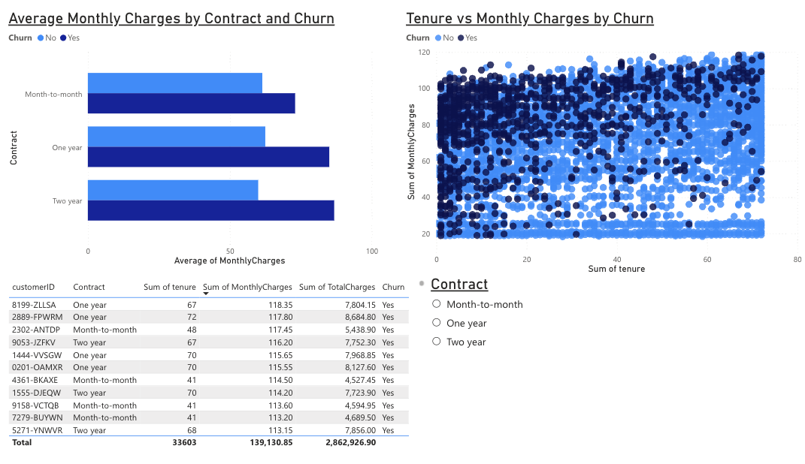
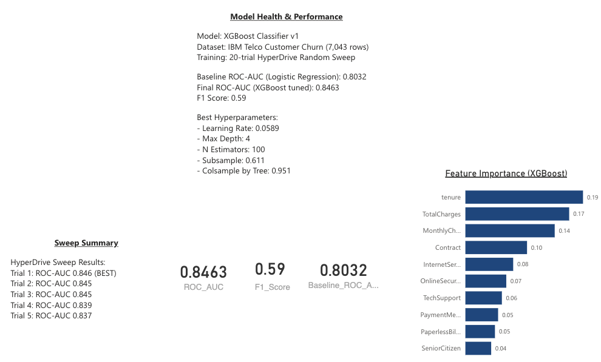

# Azure MLOps Pipeline — IBM Telco Customer Churn
**[Live Dashboard →](https://app.powerbi.com/groups/me/reports/4dd8ce47-59fb-4589-ba3f-86e5fca43d2d/5f91b76b51d97b356c83?experience=power-bi)**

An end-to-end MLOps pipeline built on Microsoft Azure, covering data ingestion, model training, hyperparameter tuning, REST API deployment, and business intelligence reporting.

---

## Overview

This project demonstrates a production-style MLOps workflow using the IBM Telco Customer Churn dataset (7,043 rows). The pipeline spans data engineering, model development, containerized deployment, and stakeholder-facing dashboarding — all hosted on Azure.

**Key result:** XGBoost classifier tuned via HyperDrive achieved **ROC-AUC 0.8463**, compared to a logistic regression baseline of **0.8032**.

---

## Architecture

```
Raw Data (CSV)
     │
     ▼
Azure Data Factory (ADF)
     │  Ingestion pipeline
     ▼
ADLS Gen2 (Data Lake)
     │  Parquet storage
     ▼
Azure Machine Learning
     │  MLflow experiment tracking
     │  HyperDrive hyperparameter sweep (20 trials)
     │  Model registry
     ▼
Docker + FastAPI
     │  Containerized inference endpoint
     ▼
Azure Container Instances (ACI)
     │  Live REST API
     ▼
Power BI Service
     │  3-page dashboard
     ▼
Stakeholder Reporting
```

---

## Tech Stack

| Layer | Technology |
|---|---|
| Cloud Platform | Microsoft Azure |
| Data Ingestion | Azure Data Factory |
| Data Storage | Azure Data Lake Storage Gen2 (ADLS Gen2) |
| ML Training & Tracking | Azure Machine Learning, MLflow 2.4.2 |
| Hyperparameter Tuning | Azure HyperDrive (Random Sweep) |
| Model Serving | FastAPI, Docker |
| Deployment | Azure Container Instances (ACI) |
| Dashboarding | Power BI Service |
| Language | Python 3 |

---

## Dataset

**IBM Telco Customer Churn**
- 7,043 customer records
- Target variable: `Churn` (binary)
- Features include tenure, contract type, internet service, monthly charges, total charges, and 15+ additional service attributes
- Source: [IBM Sample Datasets](https://www.ibm.com/communities/analytics/watson-analytics-blog/guide-to-sample-datasets/)

---

## Pipeline Phases

### Phase 1–2: Data Ingestion
- Configured ADLS Gen2 storage account with hierarchical namespace enabled
- Built ADF pipeline to ingest raw CSV data and store as Parquet in ADLS Gen2

### Phase 3–4: Data Exploration & Feature Engineering
- Exploratory analysis of churn drivers (tenure, contract type, monthly charges)
- Encoded categorical variables, handled missing values in `TotalCharges`
- Train/test split with stratification on churn label

### Phase 5–6: Model Training & Experiment Tracking
- Trained baseline Logistic Regression model tracked via MLflow
- Trained XGBoost classifier and registered best model in Azure ML model registry
- All runs logged: parameters, metrics, and artifacts

### Phase 7: Hyperparameter Tuning
- 20-trial HyperDrive random sweep over XGBoost hyperparameter space
- Search space:

| Parameter | Range |
|---|---|
| Learning Rate | Uniform(0.01, 0.3) |
| Max Depth | Choice(3, 4, 5, 6) |
| N Estimators | Choice(50, 100, 150, 200) |
| Subsample | Uniform(0.5, 1.0) |
| Colsample by Tree | Uniform(0.5, 1.0) |

- Best trial results (top 5):

| Trial | ROC-AUC |
|---|---|
| Trial 1 (Best) | 0.846 |
| Trial 2 | 0.845 |
| Trial 3 | 0.845 |
| Trial 4 | 0.839 |
| Trial 5 | 0.837 |

### Phase 8: Model Deployment
- Containerized FastAPI inference endpoint with Docker
- Deployed to Azure Container Instances (ACI) as a live REST API
- Endpoint accepts JSON input and returns churn probability score

> **Note:** Azure Managed Online Endpoints are not available on Azure for Students subscriptions. ACI + FastAPI was used as an equivalent production-viable alternative.

### Phase 9: FastAPI Endpoint
- `/predict` POST endpoint accepting customer feature JSON
- Returns churn probability and binary classification
- Swagger UI available at `/docs`

### Phase 10: Power BI Dashboard
3-page Power BI Service report connected to ADLS Gen2 data:

| Page | Content |
|---|---|
| Page 1 | Churn overview KPIs and trend analysis |
| Page 2 | Customer segment breakdowns (contract, internet service, tenure) |
| Page 3 | Model health — ROC-AUC cards, HyperDrive sweep summary, feature importance chart |

---

## Model Results

| Metric | Value |
|---|---|
| Baseline ROC-AUC (Logistic Regression) | 0.8032 |
| Final ROC-AUC (XGBoost tuned) | 0.8463 |
| F1 Score | 0.59 |

**Best Hyperparameters:**
- Learning Rate: 0.0589
- Max Depth: 4
- N Estimators: 100
- Subsample: 0.611
- Colsample by Tree: 0.951

**Top Features by Importance:**

| Feature | Importance |
|---|---|
| tenure | 0.187 |
| TotalCharges | 0.165 |
| MonthlyCharges | 0.142 |
| Contract | 0.098 |
| InternetService | 0.076 |

---

## Dashboard

*(Screenshots below — full dashboard available in `/screenshots`)*

**Page 1 — Churn Overview**


**Page 2 — Customer Segments**


**Page 3 — Model Health**

---

## Infrastructure Notes

- Region: **North Central US** (eastus excluded due to Azure for Students vCPU quota constraints)
- Compute: **Standard_DS1_v2** (1 vCPU, 3.5 GB RAM) — within 6 vCPU Azure for Students limit
- MLflow version: **2.4.2** (downgraded from latest to resolve Azure ML SDK compatibility issues)
- Managed Online Endpoints replaced with **FastAPI + Docker + ACI** due to Azure for Students subscription restrictions

---

## Repository Structure

```
├── data/
│   └── telco_churn.csv
├── notebooks/
│   ├── 01_eda.ipynb
│   ├── 02_feature_engineering.ipynb
│   └── 03_training.ipynb
├── src/
│   ├── train.py
│   ├── score.py
│   └── app/
│       ├── main.py          # FastAPI app
│       └── Dockerfile
├── pipelines/
│   └── adf_pipeline.json
├── screenshots/
│   ├── page1_churn_overview.png
│   ├── page2_customer_segments.png
│   └── page3_model_health.png
└── README.md
```

---

## Skills Demonstrated

- Cloud data engineering (ADF, ADLS Gen2, Parquet)
- ML experiment tracking and model registry (MLflow, Azure ML)
- Automated hyperparameter optimization (HyperDrive)
- Model containerization and REST API deployment (Docker, FastAPI, ACI)
- Business intelligence dashboarding (Power BI Service)
- Constraint-driven architecture decisions (Azure for Students quota management)
